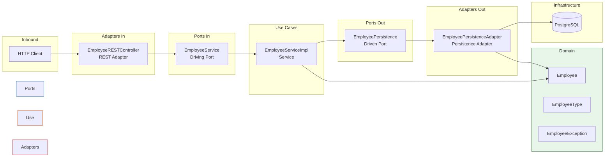

# Architecture

Hexagonal Architecture (Ports & Adapters), enforced by [ArchUnit tests](../src/test/java/com/jfi/api/ApplicationTest.java).



## Package Structure

```
com.jfi.api.employee/
├── domain/                          # Domain model (Employee, EmployeeType, exceptions)
├── port/
│   ├── in/                          # Driving ports (EmployeeService interface)
│   └── out/                         # Driven ports (EmployeePersistence interface)
├── usecase/                         # Use case implementations (EmployeeServiceImpl)
└── adapter/
    ├── in/rest/                     # REST adapter (controller, DTOs, exception handler)
    └── out/persistence/             # Persistence adapter (R2DBC repository)

com.jfi.api.infrastructure/          # Cross-cutting: filters, aspects, observability config
```

## Dependency Rules

Dependencies point **inward**: adapters → ports/use cases → domain.

| Rule | Constraint |
|------|-----------|
| Domain isolation | Domain depends on nothing else |
| Port isolation | Ports do not depend on adapters |
| Use case isolation | Use cases depend on ports, not adapters |
| Adapter separation | Inbound adapters do not depend on outbound adapters |
