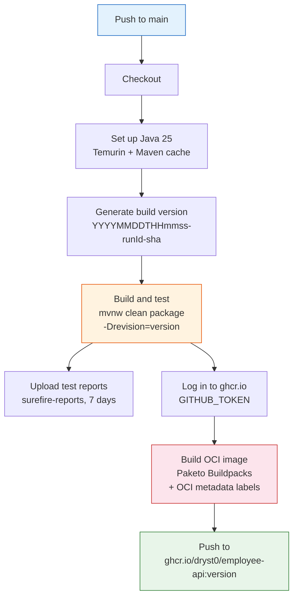

# CI Pipeline

GitHub Actions workflow triggered on every push to `main`.



## Version Pattern

```
<UTC timestamp>-<workflow run ID>-<short commit SHA>
```

Example: `20260220T103045-12345678-abc1234`

This version flows through:
- **JAR filename** — `employee-<version>.jar`
- **JAR manifest** — `Implementation-Version: <version>`
- **OCI image tag** — `ghcr.io/dryst0/employee-api:<version>`
- **OCI label** — `org.opencontainers.image.version`

## OCI Image Labels

| Label | Source |
|-------|--------|
| `org.opencontainers.image.title` | Paketo auto-detection (artifact name) |
| `org.opencontainers.image.version` | Build version (from `-Drevision`) |
| `org.opencontainers.image.source` | Repository URL |
| `org.opencontainers.image.revision` | Full commit SHA (40 chars) |
| `org.opencontainers.image.created` | RFC 3339 build timestamp |
