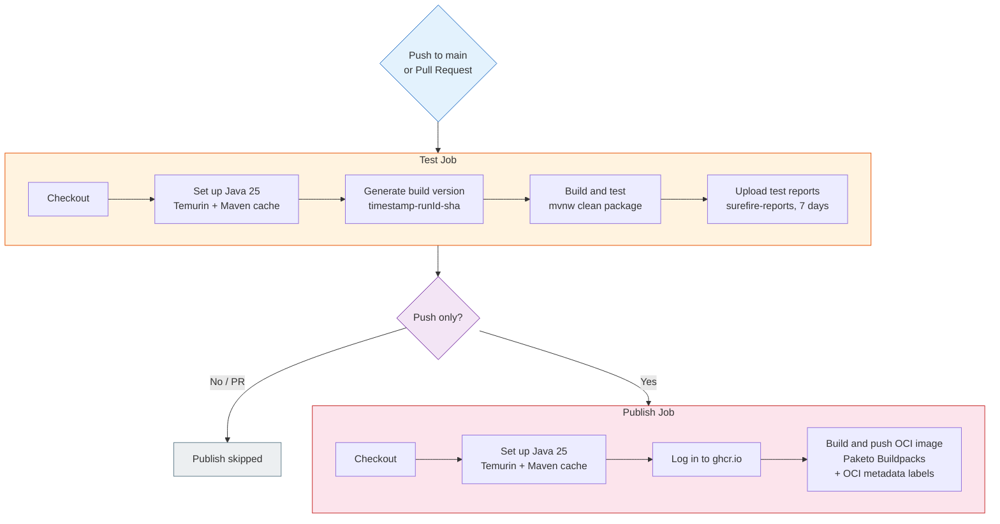

# CI Pipeline

GitHub Actions workflow with two jobs, triggered on push to `main` and pull requests targeting `main`. Only runs when source, build, or workflow files change.



## Triggers

| Event | Branches | Path filters |
|-------|----------|-------------|
| `push` | `main` | `src/**`, `pom.xml`, `.mvn/**`, `mvnw`, `.github/workflows/ci.yml` |
| `pull_request` | `main` | Same as push |

## Concurrency

One run at a time per branch or PR. New pushes cancel in-progress runs.

- Push runs: grouped by `refs/heads/main`
- PR runs: grouped by PR number (won't cancel main branch runs)

## Version Pattern

```
<UTC timestamp>-<workflow run ID>-<short commit SHA>
```

Example: `20260220T103045-12345678-abc1234`

This version flows through:
- **JAR filename** — `employee-<version>.jar`
- **JAR manifest** — `Implementation-Version: <version>`
- **OCI image tag** — `ghcr.io/dryst0/employee-api:<version>`
- **OCI label** — `org.opencontainers.image.version`

## OCI Image Labels

| Label | Source |
|-------|--------|
| `org.opencontainers.image.title` | Paketo auto-detection (artifact name) |
| `org.opencontainers.image.version` | Build version (from `-Drevision`) |
| `org.opencontainers.image.source` | Repository URL |
| `org.opencontainers.image.revision` | Full commit SHA (40 chars) |
| `org.opencontainers.image.created` | RFC 3339 build timestamp |

## Supply Chain Security

- All GitHub Actions pinned to full commit SHAs (not version tags)
- [Dependabot](../.github/dependabot.yml) updates Maven and GitHub Actions dependencies weekly, grouped into one PR per ecosystem
