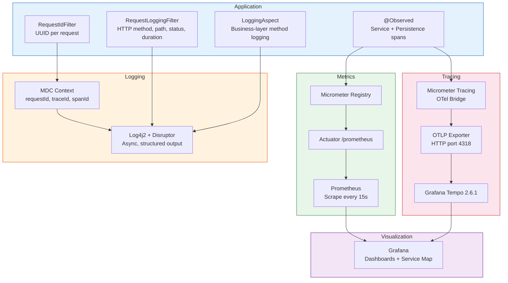

# Observability

Three-pillar observability with structured logging, metrics, and distributed tracing.



## Filter Chain

| Component | Responsibility |
|-----------|---------------|
| `RequestIdFilter` | Generates UUID, stores in MDC + Reactor Context, returns `X-Request-Id` header |
| `RequestLoggingFilter` | Logs every HTTP request (including framework-rejected ones like 405) with timing |
| `LoggingAspect` | AOP-based method logging for controllers, use cases, and persistence adapters |

## Profile Configuration

| Setting | Dev | Staging | Prod |
|---------|-----|---------|------|
| Trace sampling | 100% | 50% | 10% |
| App log level | DEBUG | INFO | INFO |
| Root log level | INFO | INFO | WARN |
| Actuator endpoints | All | health, info, prometheus | health, prometheus |
| OTLP endpoint | localhost:4318 | `${OTLP_TRACING_ENDPOINT}` | `${OTLP_TRACING_ENDPOINT}` |

## Log Format

```
<ISO8601 UTC> <LEVEL> [thread] [requestId=...] [traceId=...] [spanId=...] <logger> - <message>
```

Context propagation through reactive chains is handled by `spring.reactor.context-propagation=auto` and `Mono.deferContextual()` in the `LoggingAspect`.
