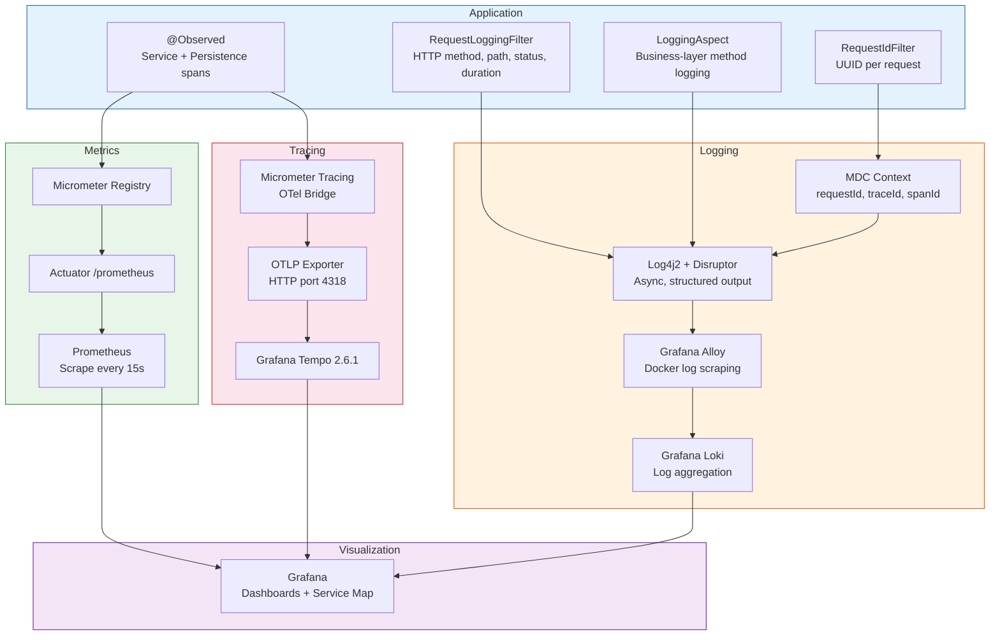

# Observability

Three-pillar observability with structured logging, metrics, and distributed tracing.


```mermaid
flowchart TD
    subgraph Application
        REQ_FILTER[RequestIdFilter<br/>UUID per request]
        LOG_FILTER[RequestLoggingFilter<br/>HTTP method, path, status, duration]
        LOG_ASPECT[LoggingAspect<br/>Business-layer method logging]
        OBSERVED["@Observed<br/>Service + Persistence spans"]
    end

    subgraph Logging
        LOG4J2[Log4j2 + Disruptor<br/>Async, structured output]
        MDC[MDC Context<br/>requestId, traceId, spanId]
        ALLOY[Grafana Alloy<br/>Docker log scraping]
        LOKI[Grafana Loki<br/>Log aggregation]
    end

    subgraph Metrics
        MICROMETER[Micrometer Registry]
        ACTUATOR[Actuator /prometheus]
        PROMETHEUS[Prometheus<br/>Scrape every 15s]
    end

    subgraph Tracing
        OTEL_BRIDGE[Micrometer Tracing<br/>OTel Bridge]
        OTLP[OTLP Exporter<br/>HTTP port 4318]
        TEMPO[Grafana Tempo 2.6.1]
    end

    subgraph Visualization
        GRAFANA[Grafana<br/>Dashboards + Service Map]
    end

    REQ_FILTER --> MDC
    LOG_FILTER --> LOG4J2
    LOG_ASPECT --> LOG4J2
    MDC --> LOG4J2
    LOG4J2 --> ALLOY
    ALLOY --> LOKI

    OBSERVED --> MICROMETER
    MICROMETER --> ACTUATOR
    ACTUATOR --> PROMETHEUS

    OBSERVED --> OTEL_BRIDGE
    OTEL_BRIDGE --> OTLP
    OTLP --> TEMPO

    PROMETHEUS --> GRAFANA
    TEMPO --> GRAFANA
    LOKI --> GRAFANA

    style Application fill:#e3f2fd,stroke:#1565c0
    style Logging fill:#fff3e0,stroke:#e65100
    style Metrics fill:#e8f5e9,stroke:#2e7d32
    style Tracing fill:#fce4ec,stroke:#c62828
    style Visualization fill:#f3e5f5,stroke:#6a1b9a
```

## Filter Chain

| Component | Responsibility |
|-----------|---------------|
| `RequestIdFilter` | Generates UUID, stores in MDC + Reactor Context, returns `X-Request-Id` header |
| `RequestLoggingFilter` | Logs every HTTP request (including framework-rejected ones like 405) with timing |
| `LoggingAspect` | AOP-based method logging for controllers, use cases, and persistence adapters |

## Profile Configuration

| Setting | Dev | Staging | Prod |
|---------|-----|---------|------|
| Trace sampling | 100% | 50% | 10% |
| App log level | DEBUG | INFO | INFO |
| Root log level | INFO | INFO | WARN |
| Actuator endpoints | All | health, info, prometheus | health, prometheus |
| OTLP endpoint | localhost:4318 | `${OTLP_TRACING_ENDPOINT}` | `${OTLP_TRACING_ENDPOINT}` |

## Log Format

```
<ISO8601 UTC> <LEVEL> [thread] [requestId=...] [traceId=...] [spanId=...] <logger> - <message>
```

Context propagation through reactive chains is handled by `spring.reactor.context-propagation=auto` and `Mono.deferContextual()` in the `LoggingAspect`.

## Centralized Logging

Logs are aggregated via **Grafana Loki**, collected by **Grafana Alloy**.

| Component | Role |
|-----------|------|
| Log4j2 Console appender | App writes structured logs to stdout |
| Docker | Captures container stdout as JSON log files |
| Grafana Alloy | Scrapes Docker container logs, extracts `level` label, pushes to Loki |
| Grafana Loki | Stores and indexes logs, queryable via Grafana Explore |

**Correlation:** Grafana links logs and traces bidirectionally — Loki `derivedFields` extracts `traceId` from log lines to link to Tempo, and Tempo `tracesToLogsV2` filters Loki by trace ID.

**Local dev note:** When running via `./mvnw spring-boot:run` (host, not containerized), logs appear in the terminal only. Loki integration requires the app to run as a Docker container (`docker compose up`).
